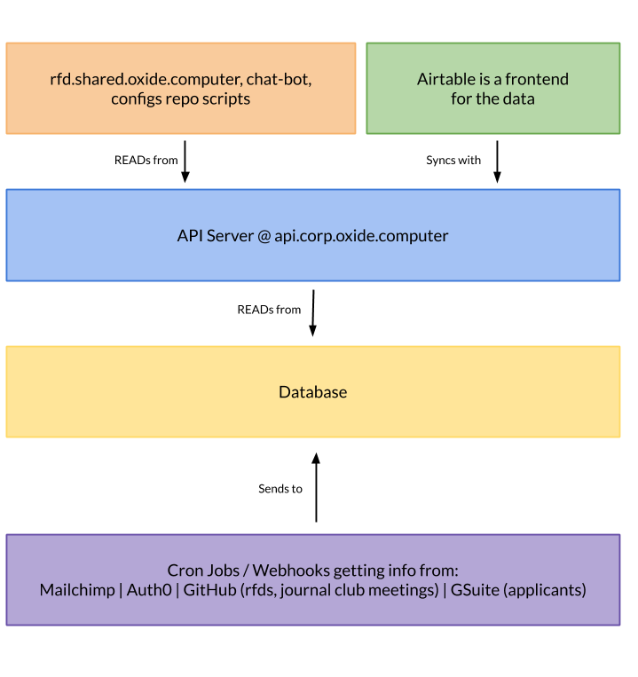

# cio

Helper functions and types for doing the activities of a CIO.

### Configuration

#### Runtime Flags

Specific runtime behaviors can be controlled via environment variables. Flags are disabled by default and setting the variable to `true` will enable the feature.

| Flag               | Description |
| ------------------ | ----------- |
| RFD_PDFS_IN_GITHUB | Enables committing of rendered RFD PDFs back to their source repo |
| RFD_PDFS_IN_GOOGLE_DRIVE | Enables writing of rendered RFD PDFs to Google Drive |

The architecture for this application server and all it's surroundings is:

